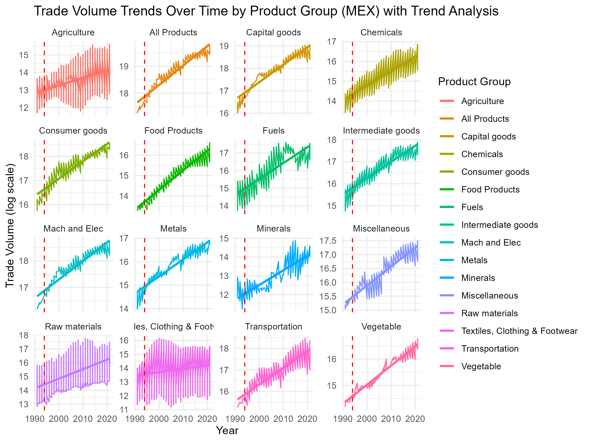

**##1. Project Overview and Data Description:**

***Embarking on a Trade Tale:***

Our journey begins with a singular quest: to explore the impact of the North American Free Trade Agreement (NAFTA) on the trade dynamics of various industry sectors in the United States from 1994 to 2020. This exploration revolves around a central research question: How has NAFTA influenced the trade volume and value between the U.S. and its NAFTA partners, Canada and Mexico, across different industry sectors?

***NAFTA: A Trade Milestone:***

The narrative of NAFTA is one of ambition and transformation. Implemented to dismantle trade barriers between the U.S., Canada, and Mexico, this agreement promised to reshape economic relationships. Our mission is to delve into this transformative era, to analyze the intricate patterns of trade that emerged.

***The Data Saga:***

Our tale is underpinned by robust data from the World Integrated Trade Solutions, comprising `CAN_exp.csv`, `CAN_Imp.csv`, `MEX_exp.csv`, and `MEX_imp.csv`. These datasets are more than mere numbers; they encapsulate the ebbs and flows of exports and imports, telling a story of interconnected economies.

***Peeling the Data Layers:***

We encountered a wide array of products grouped into 21 categories. Our task was to simplify this complexity, categorizing similar products to reveal clearer trade patterns. This process is akin to cataloging a library of goods, where each item finds its rightful place, contributing to our understanding of the broader trade narrative.

***A Story in Time and Trade:***

Our analysis is anchored in time, with each year unfolding new chapters in the NAFTA story. We transformed these datasets to put 'Year' at the forefront, guiding us through the evolution of trade relationships.

***In Conclusion:***

Set against the backdrop of NAFTA, our exploration seeks to piece together a comprehensive story. It's a narrative not just about trade volumes or values, but about the evolving dynamics of economic cooperation and competition in North America. Our goal is to provide insights that are not only reflective of past and present trends but also indicative of future trajectories in this ever-changing landscape of international trade.

**##2. Enhanced Data Processing and Methodology:**

***Embarking on Our Data Journey:***

Our exploration into the depths of NAFTA's influence began with an extensive collection of trade data, diving into the intricate world of exports and imports among the U.S., Canada, and Mexico. We meticulously sifted through data spanning from 1994 to 2021, a treasure trove of information that promised to reveal the hidden stories of trade dynamics.

***Crafting Data for Clarity:***

Transforming this massive data set into something we could work with was our first challenge. We reshaped each dataset into a long format, where each row told the story of a year and a product. This format made it easier to trace trends and patterns over time, like connecting dots in a constellation to map out the trade universe.

***Merging Worlds:***

With datasets for Canada and Mexico's exports and imports in hand, we merged them into one comprehensive frame. This big picture approach was crucial - it let us see how trade winds blew across countries and sectors, giving us a complete view of the NAFTA landscape.

***Streamlining and Cleaning:***

Our next step was akin to filtering gold from sand. We simplified our data by focusing on key variables, especially product groups. Think of it as distilling the essence of the data - getting to the heart of what matters most. We transformed and cleaned the data, ensuring every piece was in its right place, ready for analysis. 

***Visual Narratives:***

Choosing the right visuals was like picking the right lens to view our data through. Each plot had a purpose:
- *Line Charts for Trade Trends:* These charts were our time machines, letting us travel through the years and witness how trade evolved, especially during key historical moments.
- *Overlayed Density Plots for NAFTA vs. Non-NAFTA:* Here, we compared the trade volumes under NAFTA with those outside it, using peaks and valleys in the data to show the agreement's real impact.
- *Heat Maps and More:* Our use of heat maps, bubble charts, and treemaps turned complex data into a visual feast, revealing patterns and trends that numbers alone couldn't express.

**##3. Synthesized Findings and Analysis: A Visual Journey Through NAFTA's Impact**

Our analysis, enriched with various visual interpretations, paints a vivid picture of NAFTA's influence on trade dynamics.

***1. The Landscape of Trade Volumes (Treemap of Trade Volumes for NAFTA Product Groups):***

   Our journey begins with a treemap, which displays the relative sizes of trade volumes across NAFTA product groups. Raw Materials and Agriculture dominate this landscape, suggesting their crucial role in NAFTA trade. This visualization hints at a symbiotic relationship between these sectors, while also highlighting the smaller but significant contributions of sectors like metals and minerals.

***2. Evolving Trade Partnerships (Comparative Trade Trends of Canada and Mexico Over Time by Value - Line Chart):***

   -  Next, a line chart reveals the shifting sands of trade partnerships. Initially, Canada leads in import and export values, but as time progresses, Mexico surges ahead. The chart pinpoints significant deviations in 2008, 2014, and 2019, reflecting global economic upheavals. By 2021, Mexico emerges as the primary U.S. trading partner, a testament to changing economic ties under NAFTA.

***3. Density of Trade (Overlayed Density Plot for NAFTA and Non-NAFTA Data):***

   - An overlayed density plot offers a deeper dive into trade volumes. The plot shows NAFTA-centric trade skewing towards higher values, with its mode noticeably to the right compared to Non-NAFTA trade. This visualization underscores NAFTA's role in amplifying trade volumes within its member countries.

***4. Sectoral Shifts and Growth (Comparison Stacked Bar Chart):***

   - A stacked bar chart comes next, comparing the proportional growth of trade sectors at the start and end of our study period. Notable growth is observed in consumer goods and capital goods, while other sectors like minerals and fuels show less prominence. The chart illustrates both the winners and the areas with less pronounced growth under NAFTA.

***5. Colorful Dynamics of Trade (Heat Map of Trade Volumes with Percent Increases):***

   -  A heat map then brings color to our analysis, showcasing percent increases in trade volumes. Bright reds in sectors like capital goods and machinery contrast with the cooler blues of agriculture and minerals. This color gradient vividly captures the sectors that have heated up the most under NAFTA.

***6. Canada's Trade Trajectory (Trade Volume Trends Over Time by Product Group for Canada - Trend Analysis):***

   - Focusing on Canada, a series of trend analyses for each product group reveals varied growth patterns. From the resilience in food products to the volatility in capital goods and the slump in transportation post-2008, these trends paint a picture of Canada's mixed fortunes under NAFTA.

***7. Mexico's Rising Tide (Trade Volume Trends Over Time by Product Group for Mexico - Trend Analysis):***

   - Contrasting Canada, Mexico's growth narrative is more consistently upward, particularly in sectors like capital goods. The only notable exception is fuels, reflecting the global shift towards U.S. energy independence.

***8. Comparative Growth Patterns (Trade Volume Bubble Chart for Canada and Mexico):***

   - Finally, a bubble chart comparing Canada and Mexico across product groups encapsulates the overarching theme: Mexico's trade volumes have generally surpassed Canada's in most sectors. This visualization sharply illustrates NAFTA's asymmetrical benefits and its role in boosting trade volumes.

***Concluding Insights:***

Our visual exploration through NAFTA's trade landscape highlights a complex interplay of sectoral growth, shifting economic ties, and the nuanced impacts of global events. The diverse visualizations not only make the data accessible but also weave a story of change, adaptation, and growth in the North American trade ecosystem.

**##4. Executive Summary:**

***Unveiling NAFTA's Trade Impact:***

This report delves into the complex tapestry of the North American Free Trade Agreement's (NAFTA) influence on trade dynamics among the U.S., Canada, and Mexico from 1994 to 2021. Through a blend of meticulous data analysis and vivid visual storytelling, we unravel how NAFTA reshaped trade volumes and values across various industry sectors.

**Key Insights:**

1. ***Shift in Trade Dynamics:*** Our analysis uncovered a significant shift in trade relationships. Initially led by Canada, Mexico gradually emerged as the U.S.'s primary trading partner. This transition was marked by pivotal events, notably in 2008, 2014, and 2019, reflecting global economic shifts.

2. ***The Density of Trade under NAFTA:*** A comparative study of NAFTA-centric and Non-NAFTA-centric sectors revealed a higher concentration of trade volumes in NAFTA-centric sectors, highlighting the agreement's success in fostering trade among member countries.

3. ***Sector-Specific Growth Patterns:*** Diverse growth trends emerged across sectors. While food products, chemicals, and capital goods experienced substantial growth, textiles and agriculture saw moderate increases.

4. ***Canada vs. Mexico – Contrasting Trajectories:*** Canada's trade growth under NAFTA was mixed, with some sectors showing volatility and others resilience. In contrast, Mexico displayed a more uniform pattern of robust growth across most sectors, particularly in capital goods.

5. ***Visual Narratives of Trade:*** Our use of various visual tools – including treemaps, line charts, density plots, and heat maps – painted an engaging picture of NAFTA's trade dynamics. These visuals not only illuminated the data but also brought to life the stories behind the numbers.

6. ***NAFTA's Asymmetrical Benefits:*** The comparison between Canada and Mexico highlighted NAFTA's uneven impact. Mexico benefited more consistently from the agreement, a reflection of its growing significance in the global trade network.

**Concluding Reflection:**

Our exploration reveals that NAFTA, while generally boosting trade volumes, had a nuanced and varied impact across sectors and countries. The agreement catalyzed growth and realignment in North American trade, with Mexico emerging as a particularly strong beneficiary. While NAFTA has now transitioned into the United States-Mexico-Canada Agreement (USMCA), this analysis provides valuable historical insights into the trade dynamics under NAFTA, offering a foundation understanding of the trade relationships that continue to evolve under the new agreement.

